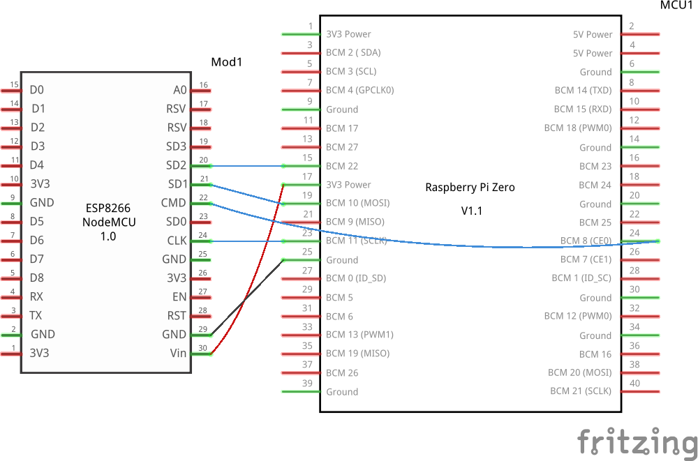

# acm-christmas

Needs Nix. To enter, run `nix-shell`.

## Shopping List

- [ ] [Christmas Tree](https://www.amazon.com/Best-Choice-Products-Artificial-Christmas/dp/B018FDYGVM)
    - Price: $49.99
    - Size: 6ft (~1.8m)
- [x] Raspberry Pi
    - ~~Stolen~~ Borrowed from ACM
- [ ] ESP32 Microcontroller
- [ ] [LED Strips (12V)](https://www.amazon.com/ALITOVE-LED-Individually-Addressable-Waterproof/dp/B01AG923EU)
    - Actual LED bulbs rather than strips, so better for 2D use.
    - 0.3W per bulb, 50 bulbs per strip, 15W per strip
        - For 5V, 3A per strip
        - For 12V, 1.25A per strip
    - Price:
        - $18.50 (50x, 13ft, 4m)
        - $37.00 (100x, 26ft, 8m)
        - $55.50 (150x, 39ft, 12m)
- [ ] [LED Power Supply (12V)](https://www.amazon.com/ALITOVE-Adapter-Converter-100-240V-5-5x2-1mm/dp/B01GEA8PQA)
    - Price: $11.99
    - 12V 5A, so can power 4 strips or 200 bulbs

## Hardware

The hardware stack requires two boards:

- A Raspberry Pi, which runs the main daemon and exposes the network API, and
- An ESP32 microcontroller, which controls the LEDs.

They should be wired according to this schematic:



### Raspberry Pi

The Raspberry Pi will run the main daemon, which is in charge of:

- Accepting Protobuf commands and handling them,
- Running interpolation algorithms to convert images into LED data
  (if required), and
- Sending the LED data to the ESP32.

The Raspberry Pi should run a very minimal Linux distribution, such as [Alpine
Linux](https://alpinelinux.org/) or, even better, some kind of embedded Linux
distribution that supports real-time scheduling.

Ideally, the Go daemon should also be optimized:

- No allocations should be performed during the main loop, and
- It should run with real-time scheduling.

We could leverage Go's pprof to profile the daemon and see where it's spending
most of its time. Some real-world benchmarking will be required.

### ESP32

The ESP32 will run a very simple daemon that accepts controlling packets from
the Raspberry Pi and controls the LEDs accordingly.

The ESP32 will communicate with the Raspberry Pi over SPI. The Raspberry Pi
will be the master and the ESP32 will be the slave.

The SPI byte protocol is as follows:

```
== Scalar Types ==

uint8:  1 byte
uint32: 4 bytes, little-endian

== Top-level Protocol ==

Byte 0..1: Packet Type
Byte 0..n: Packet Data

All packets must be fixed-length, meaning that the length of the packet data
must be known in advance.

== Packet Types ==

0x0: Reset
    Resets the state of the ESP32. This will allow the Pi to set the number of
    LEDs.

    Length: 5

    Byte 0..1: 0x0
    Byte 1..4: Number of LEDs (uint32)

0x1: Set LED Data
    Sets the colors of all LEDs.

    Length: 1 + (3 * num_leds)

    Byte 0..1: 0x1
    Byte 1..2: Green value of LED 0 (uint8)
    Byte 2..3: Red value of LED 0 (uint8)
    Byte 3..4: Blue value of LED 0 (uint8)
    Byte 4..5: Green value of LED 1 (uint8)
    Byte 5..6: Red value of LED 1 (uint8)
    Byte 6..7: Blue value of LED 1 (uint8)
    ...


Minimum packet size: 5 bytes
```

The ESP32 uses GPIO pin 9 that is connected to the Raspberry Pi's GPIO pin 22
as the interrupt (or signaling) pin. The ESP32 will use this pin to signal to
the Raspberry Pi that it is ready to receive commands.

Interrupts are active-high, meaning that the ESP32 will pull the pin high when
it is ready to receive commands.

An example sequence of commands is as follows:

1. Raspberry Pi waits for active-high signal on GPIO pin 22.
2. ESP32 sets GPIO pin 9 to high and starts reading commands from the SPI bus.
3. Raspberry Pi receives the signal and sends a reset command to the ESP32.
4. Raspberry Pi waits for GPIO pin 9 to go low.
5. ESP32 finishes reading the reset command and sets GPIO pin 9 to low.
6. ESP32 resets its state and sets GPIO pin 9 to high, signaling that it is
   ready to receive commands.
7. Raspberry Pi waits for GPIO pin 9 to go high.
8. Raspberry Pi moves on to the next command.

Note that the interrupt pin is used to make signaling a synchronous operation.
The ESP32 must acknowledge the command before the Raspberry Pi can move on to
the next command. If the acknowledge is not received within a certain timeout,
the Raspberry Pi will fatally error out.

## Tools

**You must run `make`** before running any of the tools.

### live-capture

Starts an FFmpeg daemon that keeps an up-to-date BMP image that is the
current frame of the given webcam.

Before running `live-capture`, you must first edit `camerarc` to specify the
webcam you want to use. You can find the name of your webcam by running
`v4l2-ctl --list-devices`.

Then, to start capturing, run:

```sh
live-capture start
```

To start capturing with a black-and-white threshold filter:

```sh
live-capture start --filter-args "$(ffutil threshold 640x480 0.5)"
```

To view a snapshot of the current frame:

```sh
live-capture view
```

To take a snapshot of the current frame onto a PNG file:

```sh
live-capture snapshot /tmp/snapshot.png
```

> **Note**: If the snapshot is also a BMP file, no conversion is performed, so
> the snapshot will be very fast.

### ledd

The actual daemon that controls the LEDs. It exposes an HTTP server that can be
invoked to set the color of a given LED as well as perform various other
higher-level tasks.

See [proto/ledd.proto](proto/ledd.proto) for the full API.

TODO: implement
